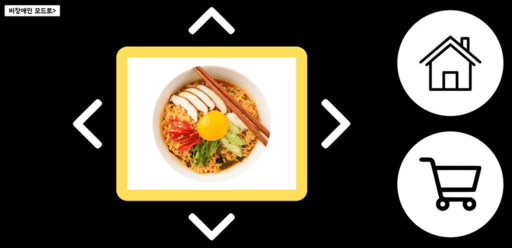
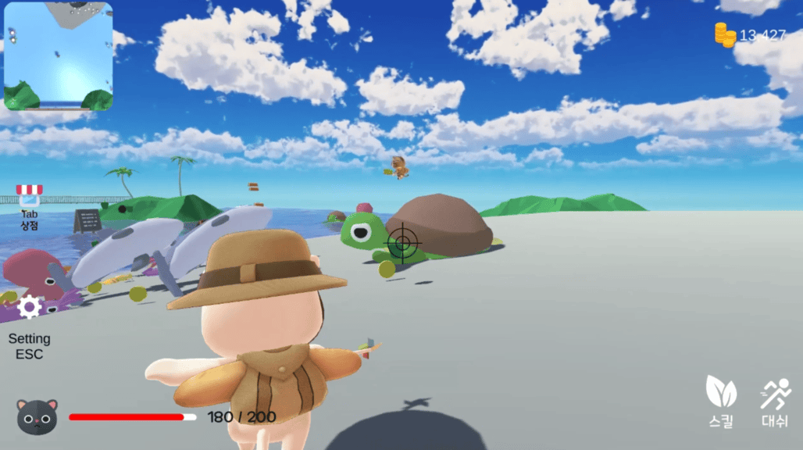
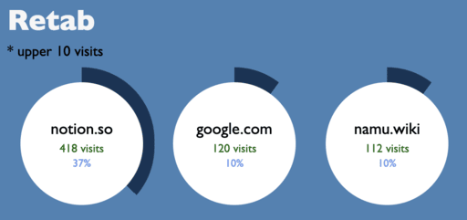

# Hello, I'm 🄹 🄰 🅈

I'm a passionate developer focusing on sincere user experience.

## 🔭 Team Projects

### SSIOSK

_Web-based kiosk for the visually impared._

- [presentation slides](https://innovative-spice-010.notion.site/SSIOSK_PPT-1c8a59eb474d802e9f82db91abf522e0)
- [source code](https://github.com/sweetandsourkiss/ssiosk)

### BOBZOO

_A rogue-like, TPS game made with Unity._

- [home page](https://bob-zoo.vercel.app/)
- [source code(home page)](https://github.com/sweetandsourkiss/bob-zoo)

## 🪀 Toy Projects

### Retab

_Rewind your tab history._

- [chrome web store](https://chromewebstore.google.com/detail/retab/noncniepfjlgndimglpfcmaeekcehjck?authuser=0&hl=ko)
- [source code](https://github.com/sweetandsourkiss/retab)

## 🌱 I’m currently learning

- [MDN: Learn web development](https://developer.mozilla.org/en-US/docs/Learn_web_development)
- [Linux for hacker](https://academy.segfaulthub.com/courses)
- [Cursor](https://www.cursor.com/)

## 🛹 Skills

<!--

-->

<!--
**sweetandsourkiss/sweetandsourkiss** is a ✨ _special_ ✨ repository because its `README.md` (this file) appears on your GitHub profile.

Here are some ideas to get you started:

- 🔭 I’m currently working on ...
- 🌱 I’m currently learning ...
- 👯 I’m looking to collaborate on ...
- 🤔 I’m looking for help with ...
- 💬 Ask me about ...
- 📫 How to reach me: ...
- 😄 Pronouns: ...
- ⚡ Fun fact: ...
-->
